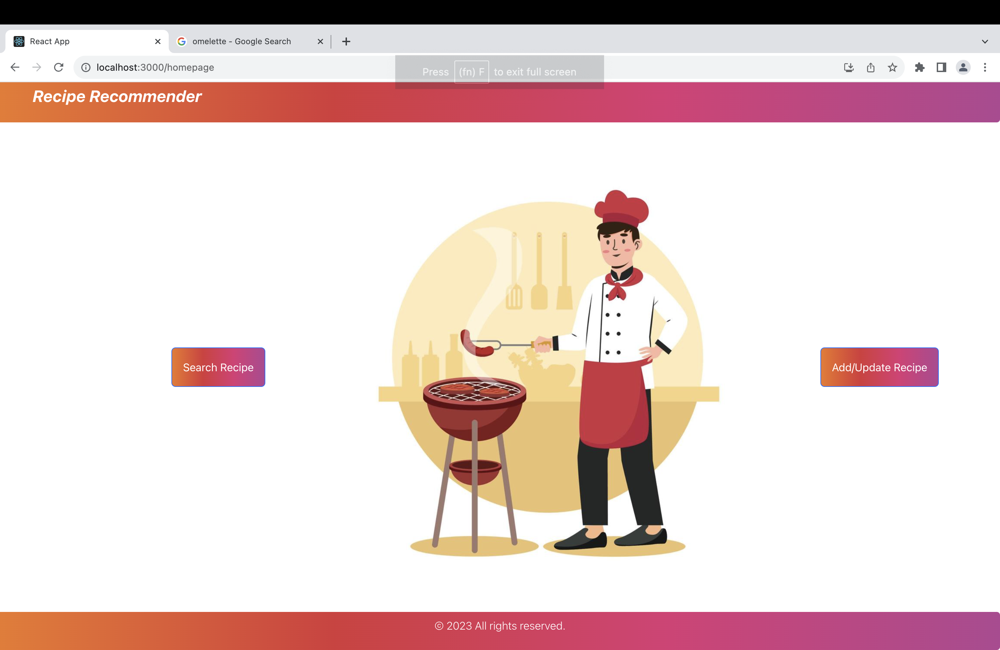
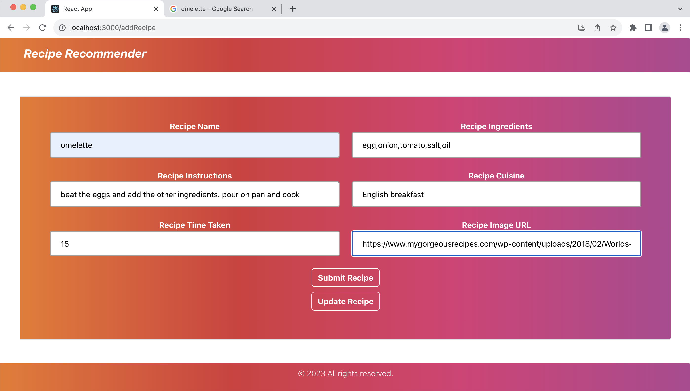
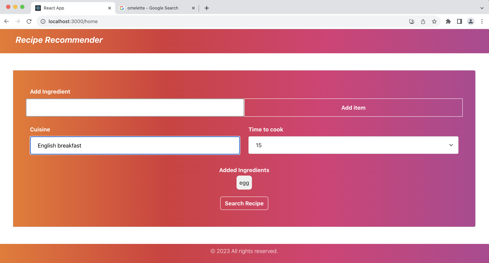

## Recipe Recommender


Recipe Recommender is an innovative application that simplifies the process of meal planning by suggesting recipes based on the ingredients you have readily available. Cooking can be a delightful experience, but deciding what to prepare with the ingredients on hand can be a daunting task. Our software is designed to alleviate this culinary challenge by offering a wide range of delectable recipes you can create using the ingredients in your kitchen.

## Video
Please find the demonstration in this [YouTube video](https://www.youtube.com/watch?v=dcHxln0QEB4).

## Key Features

- **Ingredient-Based Recommendations:** Input the ingredients you have, and Recipe Recommender will provide you with a selection of recipes that match your available items.

- **Diverse Recipe Collection:** Explore a diverse collection of recipes ranging from quick and easy weekday meals to gourmet creations for special occasions.

- **Interactive and User-Friendly:** Our user-friendly interface makes it easy to find, save, and follow your favorite recipes.

- **Effortless Meal Planning:** Say goodbye to the hassle of meal planning and let Recipe Recommender inspire your culinary journey.

## How It Works

1. Input the ingredients you have on hand.
2. Browse through a curated list of recipes that match your available ingredients.
3. Select a recipe, view the ingredients and instructions, and start cooking.

Experience the joy of cooking with Recipe Recommender, and never wonder what to prepare for a meal again. Bon appétit!

[](https://opensource.org/licenses/MIT)
[](https://www.javascript.com/)
[](https://zenodo.org/badge/latestdoi/429944963)
[](https://github.com/thosaniparth/Recipe_Recommender/issues)
[](https://badgen.net/github/stars/thosaniparth/Recipe_Recommender)

[](https://codecov.io/gh/thosaniparth/Recipe_Recommender)
[](https://github.com/thosaniparth/Recipe_Recommender/actions/workflows/Respost.yml)

[](https://github.com/thosaniparth/Recipe_Recommender/actions/workflows/close_as_a_feature.yml)

## Tech Stack

       

## Software Requirements

- [Node.js v14.7.6](https://nodejs.org/en/download/)
- [NPM v6.14.15](https://nodejs.org/en/download/)
  
## API Spec document

- https://fall-2023-se-group-14.github.io/Recipe_Recommender/

## Directory Structure

This is an overview of the directory structure of the project repository:

- **/Code**: Contains the main source code for the project.
- **/docs**: Documentation files, including READMEs, user manuals, API documentation, and SCORE CARD.
- **/frontend**: Contains the front end code for the project.
- **/backend**: Contains the backend code for the project.
- **/__tests__**: Unit tests, integration tests, and test-related code.
- **/config**: Configuration files for the project.
- **/adapter**: Adapter layer of the backend. Contains chatGPT integration.
- **/dao**: Contains the methods implemented for the various backend functionalities.
- **/dto**: Contains the models used in the project.
- **/handler**: Handler layer of the project. Contains the router files for the various modules.
- **/helpers**: Helper files.


## Setup Steps
**Installation**

1. Clone repository using "https://github.com/Fall-2023-SE-Group-14/Recipe_Recommender.git"
      ```
      git clone https://github.com/Fall-2023-SE-Group-14/Recipe_Recommender.git
      ```
2. Setup for frontend:

    open terminal and navigate to the **frontend** folder and execute the following:
      ```
      npm install
      ```
    Setup for backend:
        open terminal and navigate to the **backend** folder and execute the following:

      ```
      npm install
      ```
**Execution**
1. To start backend server
    ```
    npx nodemon
    ```
2. To start frontend server
    ```
    npm start
    ```
3. After this a window will open in the browser for login

## Modifications

1. User-friendly and improved UI
2. Added update feature to edit existing recipes.
3. Integrated chatGPT to fetch recipes for ingredients unavailable in the database.

## Modified UI





